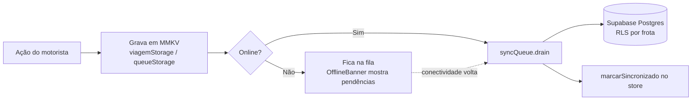

<div align="center">

# 📱 FreteAgro Mobile — App do Motorista

**Aplicativo React Native / Expo offline-first para motoristas de frota agrícola.**

O motorista inicia viagens, registra trechos com quilometragem, lança despesas e abastecimentos (tudo offline), consulta seu saldo de acerto (somente leitura) e tem todos os dados sincronizados automaticamente com o Supabase quando a conexão volta.

</div>

---

## 📑 Índice

- [Visão geral](#-visão-geral)
- [Stack tecnológica](#-stack-tecnológica)
- [Pré-requisitos](#-pré-requisitos)
- [Instalação passo a passo](#-instalação-passo-a-passo)
- [Variáveis de ambiente](#-variáveis-de-ambiente)
- [Rodando o app](#-rodando-o-app)
- [Builds com EAS](#-builds-com-eas)
- [Estrutura do projeto](#-estrutura-do-projeto)
- [Arquitetura offline-first](#-arquitetura-offline-first)
- [Testes e quality gates](#-testes-e-quality-gates)
- [Troubleshooting](#-troubleshooting)
- [Apêndice: proxy corporativo (SSL interception)](#-apêndice-proxy-corporativo-ssl-interception)

---

## 🎯 Visão geral

Este pacote faz parte do monorepo **FreteAgro** (veja o [README raiz](../README.md)). Ele é um app **Expo (managed workflow)** focado em **Android** (iOS é fase 2).

Funcionalidades principais:

- **Login com credenciais** — o dono da frota define o e-mail e a senha do motorista no painel web (`fretagro-web`); o motorista entra no app com essas credenciais (Supabase Auth via e-mail/senha).
- **Viagens criadas no app** — origem, destino, tipo de carga e km inicial, sem necessidade de pré-cadastro na web.
- **Trechos com km** — legs de ida/volta (vazio/carregado) com cálculo automático de km rodado.
- **Despesas e abastecimentos offline** — persistidos em MMKV antes de qualquer chamada de rede. Abastecimento calcula `litros × preço_por_litro` automaticamente.
- **Câmera para notas** — foto do recibo comprimida (máx. 800px, qualidade 0.7) antes do upload.
- **Saldo de acerto** — somente leitura; o cálculo vive em `@fretagro/types`.
- **Sync automático** — a fila de operações é drenada quando a conectividade é restaurada, quando o app volta ao foreground, ou no mount inicial.

---

## 🛠 Stack tecnológica

| Item | Tecnologia |
|------|-----------|
| Runtime | Expo SDK 51 / React Native 0.74 |
| Roteamento | Expo Router v3 (file-based, typed routes) |
| Estilo | NativeWind v4 (Tailwind para RN) |
| Estado global | Zustand |
| Persistência local | `react-native-mmkv` (offline-first) |
| Backend | Supabase JS Client (auth + sync) |
| Token de auth | `expo-secure-store` (nunca em MMKV) |
| Câmera | `expo-image-picker` + `expo-image-manipulator` |
| Conectividade | `expo-network` |
| Tipos/regras | `@fretagro/types` (pacote do workspace) |
| Testes | Jest + React Native Testing Library |
| Build/deploy | EAS Build (APK Android) |

---

## ✅ Pré-requisitos

| Requisito | Versão / Notas |
|-----------|----------------|
| **Node.js** | ≥ 20 LTS |
| **pnpm** | ≥ 9 — `corepack enable && corepack prepare pnpm@latest --activate` |
| **Java JDK** | 17 (necessário para o Gradle do Android) |
| **Android Studio** | Com Android SDK, Platform Tools e um AVD (API **33+**) |
| **`adb`** no PATH | Vem no Android SDK Platform Tools |
| **EAS CLI** | `pnpm add -g eas-cli` — apenas para EAS Build/Update |
| **Projeto Supabase** | O mesmo usado pelo `fretagro-web`; URL + anon key |

> Testado em **macOS** e **Windows**. Os comandos abaixo trazem as duas variantes onde há diferença de shell.

### Configurar o Android SDK

Se `adb`/`emulator` não forem encontrados, adicione o SDK ao PATH.

**macOS** — em `~/.zshrc`:

```bash
export ANDROID_HOME="$HOME/Library/Android/sdk"
export PATH="$PATH:$ANDROID_HOME/emulator:$ANDROID_HOME/platform-tools"
```

**Windows (PowerShell)** — variáveis de ambiente do usuário:

```powershell
setx ANDROID_HOME "$env:LOCALAPPDATA\Android\Sdk"
setx PATH "$env:PATH;%LOCALAPPDATA%\Android\Sdk\platform-tools;%LOCALAPPDATA%\Android\Sdk\emulator"
```

> Feche e reabra o terminal após `setx` para as variáveis entrarem em vigor.

Verifique (qualquer SO):

```bash
adb --version         # deve imprimir a versão
adb devices           # lista emuladores/dispositivos conectados
```

### Criar/iniciar um emulador

Pelo Android Studio (**Device Manager → Create Device**, escolha um Pixel + system image API 33/34), ou pela linha de comando:

```bash
# Listar AVDs existentes
emulator -list-avds

# Iniciar um AVD (substitua pelo nome do seu)
emulator -avd Pixel_7_API_34
```

---

## 📦 Instalação passo a passo

> ⚠️ **Sempre instale a partir da raiz do monorepo.** Este pacote depende do link `workspace:*` do `@fretagro/types`, que só é resolvido por um `pnpm install` na raiz.

### 1. Instalar dependências (na raiz)

```bash
cd frete-agro         # raiz do monorepo
pnpm install
```

### 2. Configurar variáveis de ambiente

Crie o arquivo `fretagro-mobile/.env.local` (veja [Variáveis de ambiente](#-variáveis-de-ambiente)):

```bash
cd fretagro-mobile
cp .env.example .env.local
# edite .env.local com a URL e a anon key do seu projeto Supabase
```

### 3. Preparar o banco (uma vez, no `fretagro-web`)

O app mobile escreve nas tabelas `trechos_km` e `abastecimentos`. Elas precisam existir com RLS aplicada:

```bash
cd ../fretagro-web
npx prisma migrate dev --name add_trecho_km_abastecimento
npx prisma generate

# Aplicar as políticas de RLS (isolamento por frota)
psql "$DATABASE_URL" < prisma/rls-policies.sql
```

> **Windows (PowerShell):** use `Get-Content prisma/rls-policies.sql | psql $env:DATABASE_URL` — ou simplesmente cole o conteúdo do arquivo no SQL Editor do Supabase.

---

## 🔐 Variáveis de ambiente

O `app.config.ts` e o `lib/supabase/client.ts` leem duas variáveis públicas do Expo de `process.env`:

| Variável | Descrição |
|----------|-----------|
| `EXPO_PUBLIC_SUPABASE_URL` | URL do projeto Supabase (ex.: `https://xxxx.supabase.co`) |
| `EXPO_PUBLIC_SUPABASE_ANON_KEY` | Chave anônima pública do Supabase |

Exemplo de `fretagro-mobile/.env.local`:

```env
EXPO_PUBLIC_SUPABASE_URL=https://SEU-PROJETO.supabase.co
EXPO_PUBLIC_SUPABASE_ANON_KEY=sua-anon-key-aqui
```

> O prefixo `EXPO_PUBLIC_` é obrigatório para que a variável seja inlined no bundle do cliente. Nunca coloque a `service_role` key aqui — o app usa apenas a anon key + RLS. O token de sessão do usuário fica exclusivamente no `expo-secure-store`.

Para **EAS Build**, defina as mesmas variáveis como **EAS Secrets**:

```bash
eas secret:create --scope project --name EXPO_PUBLIC_SUPABASE_URL --value "https://SEU-PROJETO.supabase.co"
eas secret:create --scope project --name EXPO_PUBLIC_SUPABASE_ANON_KEY --value "sua-anon-key"
```

---

## ▶️ Rodando o app

Os comandos são idênticos em **macOS** e **Windows** — os scripts do `package.json` chamam a Expo CLI diretamente, sem nenhum prefixo específico de máquina.

### Dev client nativo (recomendado — necessário para MMKV e módulos nativos)

O app usa `react-native-mmkv`, que **não** roda no Expo Go. É preciso compilar um **dev client** nativo:

```bash
cd fretagro-mobile

# Compila o APK debug, instala no emulador/dispositivo e sobe o Metro
pnpm android          # = expo run:android
```

A primeira execução compila o projeto Android via Gradle (pode demorar vários minutos). As execuções seguintes são rápidas.

### Somente Metro (quando o dev client já está instalado)

```bash
pnpm start            # = expo start
# pressione "a" para abrir no Android
```

> Se o app abrir mas o bundle não carregar após reiniciar o emulador, restaure o encaminhamento de porta do Metro:
> ```bash
> adb reverse tcp:8081 tcp:8081
> ```

---

## 🏗 Builds com EAS

Perfis definidos em [`eas.json`](eas.json):

```bash
pnpm build:dev         # profile development — APK com dev client
pnpm build:preview     # profile preview — APK release interno
pnpm build:production  # profile production — bundle release (store)
```

> Antes do primeiro build, faça login (`eas login`), configure o `projectId` em `app.config.ts` (`extra.eas.projectId`) e cadastre os EAS Secrets das variáveis de ambiente.

---

## 📁 Estrutura do projeto

```
fretagro-mobile/
├── app/                        # Expo Router (file-based routing)
│   ├── _layout.tsx             # Root layout (splash, providers, sync bootstrap)
│   ├── (auth)/                 # Fluxo público: login (e-mail + senha)
│   └── (app)/                  # Fluxo autenticado
│       ├── index.tsx           # Home
│       ├── viagem/             # iniciar, em-curso, avançar-trecho, encerrar, resumo
│       ├── despesas/           # abastecimento, geral
│       ├── historico/          # lista + detalhe [id]
│       ├── acerto/             # saldo (somente leitura) + detalhe [id]
│       └── perfil.tsx
├── components/
│   ├── ui/                     # Button, Input, Badge, Card, OfflineBanner
│   ├── viagem/                 # TrechoCard, TrechoAtual, ViagemResumo
│   ├── despesas/               # DespesaItem, FotoNota
│   └── acerto/                 # SaldoCard, AcertoItem
├── lib/                        # Lógica (sem imports de hooks/components/app)
│   ├── viagem/                 # calcularTrecho.ts, calcularViagem.ts (regras de km)
│   ├── sync/                   # syncViagem.ts, syncDespesas.ts, syncQueue.ts
│   ├── storage/                # viagemStorage.ts, queueStorage.ts (MMKV)
│   ├── camera/                 # capturarNota.ts (permissão on-demand)
│   ├── auth/                   # mobileAuth.ts (único ponto de auth Supabase)
│   └── supabase/               # client.ts (única criação do client)
├── hooks/                      # useViagemAtiva, useConectividade, useSync, useAcerto
├── store/                      # viagemStore.ts (Zustand)
├── android/                     # Projeto nativo pré-gerado (managed → bare para dev client)
├── __tests__/                  # Testes Jest (hooks, lib)
├── app.config.ts               # Config Expo (nome, scheme, env, plugins)
├── eas.json                    # Perfis de build EAS
└── tailwind.config.js          # Tema NativeWind (design tokens)
```

### Disciplina de camadas

```
@fretagro/types → lib → hooks → components → app     (dependência unidirecional)
```

- Chamadas ao Supabase só em `lib/sync/` e `lib/auth/`; **nunca** em componentes ou hooks.
- Toda escrita do motorista persiste em **MMKV antes** da rede.
- `lib/supabase/client.ts` é o **único** lugar que cria o client; auth passa só por `lib/auth/mobileAuth.ts`.
- Token de auth **apenas** em `expo-secure-store`.
- Permissão de câmera pedida **on-demand** (no toque), nunca no launch.
- Alvos de toque ≥ **44px**.

---

## 🔁 Arquitetura offline-first



O `useSyncStatus()` (usado no `_layout.tsx`) dispara o `drain()` da fila em três situações:

1. Transição de conectividade **offline → online** (via `useConectividade`).
2. No mount inicial, se já estiver online e houver pendências de uma sessão anterior.
3. Quando o app volta ao foreground (`AppState 'active'`).

---

## 🧪 Testes e quality gates

```bash
pnpm tsc              # zero erros de TypeScript (strict)
pnpm test             # Jest + React Native Testing Library
pnpm test:coverage    # cobertura (lib/ + hooks/)
```

O `jest-expo` já está configurado no `package.json`, incluindo o `moduleNameMapper` para `@fretagro/types` e um mock de `react-native-mmkv` em `__mocks__/`.

---

## 🩺 Troubleshooting

| Sintoma | Causa provável | Solução |
|---------|----------------|---------|
| App abre mas o bundle não carrega | Metro sem port forward | `adb reverse tcp:8081 tcp:8081` |
| `react-native-mmkv` crash / undefined | Rodando no Expo Go | Use o **dev client** nativo: `pnpm android` |
| `adb: command not found` | Android SDK fora do PATH | Configure `ANDROID_HOME` + `platform-tools` (ver Pré-requisitos) |
| `Included build android/null` | `./gradlew` chamado direto | Compile via `pnpm android` (`expo run:android`) |
| Build nativo some após rebuild | `expo prebuild --clean` rodou | **Não** rode prebuild; a pasta `android/` é versionada |
| Motorista não consegue entrar | Credenciais não definidas / erradas | O dono da frota define e-mail + senha no painel web; confira o cadastro do motorista |
| `Network request failed` no login/sync | Proxy corporativo (SSL interception) re-assinando TLS | Veja o [Apêndice: proxy corporativo](#-apêndice-proxy-corporativo-ssl-interception) |
| `self-signed certificate in certificate chain` no `pnpm install`/Metro | Proxy corporativo no lado do Node | Defina `NODE_EXTRA_CA_CERTS` (ver apêndice) |

---

## 🧩 Apêndice: proxy corporativo (SSL interception)

> **Ignore esta seção se você não está atrás de um proxy corporativo** (Netskope, Zscaler, etc.). Na esmagadora maioria das redes o app roda normalmente, sem nenhum ajuste — os passos acima bastam.

Proxies de interceptação SSL re-assinam todo o tráfego HTTPS — incluindo o Supabase — com uma CA corporativa privada. Nem o **Node/Metro** nem o **emulador Android** confiam nessa CA por padrão, então as chamadas falham:

- **Node / Metro** (`pnpm install`, iniciar o bundler): erros de TLS como `self-signed certificate in certificate chain`.
- **App no emulador** (login/sync do Supabase): `Network request failed`.

O projeto é genérico e **não embute nenhuma CA corporativa**. O ajuste é **local, por máquina**, e não é versionado. Builds de **release/produção não são afetados** (usam apenas as CAs do sistema).

### ⚡ Setup rápido (macOS + Netskope)

Receita completa, na ordem. Assumindo a CA local em `fretagro-mobile/certs/netskope-ca.pem`:

```bash
# 1. Node/Metro: apontar para a CA do proxy (adicione ao ~/.zshrc para não repetir)
cd /caminho/para/frete-agro
export NODE_EXTRA_CA_CERTS="$PWD/fretagro-mobile/certs/netskope-ca.pem"

# 2. (uma vez) limpar cache antigo do Gradle que ainda referencia o override removido
cd fretagro-mobile
rm -rf android/app/build/intermediates android/app/build/outputs

# 3. (uma vez por AVD) instalar a CA no emulador — com o emulador aberto
adb push certs/netskope-ca.pem /sdcard/Download/netskope-ca.pem
#    depois, NO emulador: Settings → Security → Encryption & credentials
#    → Install a certificate → CA certificate → escolher netskope-ca.pem

# 4. compilar e rodar (herda o NODE_EXTRA_CA_CERTS do passo 1)
pnpm android

# 5. se o bundle não carregar após reiniciar o emulador
adb reverse tcp:8081 tcp:8081
```

Validação: na tela de login, credenciais falsas devem retornar `Invalid login credentials` (TLS OK ✅), não `Network request failed` (❌).

> Só os passos 2 e 3 são de primeira vez. No dia a dia: garantir o `export` (ou `~/.zshrc`) + `pnpm android`.

O detalhamento de cada etapa está abaixo.

### 1. Node / Metro — `NODE_EXTRA_CA_CERTS`

Aponte para a CA (combinada) do seu proxy antes de rodar os comandos:

**macOS:**
```bash
export NODE_EXTRA_CA_CERTS="$HOME/certs/corp-ca.pem"
pnpm install && pnpm android
```

**Windows (PowerShell):**
```powershell
$env:NODE_EXTRA_CA_CERTS = "$HOME\certs\corp-ca.pem"
pnpm install; pnpm android
```

> Para tornar permanente no Windows: `setx NODE_EXTRA_CA_CERTS "%USERPROFILE%\certs\corp-ca.pem"`.

### 2. Emulador Android — instalar a CA

A config de rede principal (`android/app/src/main/res/xml/network_security_config.xml`) já confia em **CAs instaladas pelo usuário** em builds debug. Basta instalar a CA no emulador uma vez:

```bash
adb push corp-ca.pem /sdcard/Download/corp-ca.pem
# No emulador: Settings → Security → Encryption & credentials
#            → Install a certificate → CA certificate → escolha o arquivo
```

### 3. Validar o TLS (sem uma senha real)

Faça login com credenciais falsas:

- **`Invalid login credentials` (HTTP 400)** → TLS OK ✅ (a requisição chegou ao Supabase).
- **`Network request failed`** → TLS ainda quebrado ❌ (revise os passos 1 e 2).

### Extrair a CA do proxy

```bash
echo | openssl s_client -connect SEU-PROJETO.supabase.co:443 -showcerts
# Copie os certificados (intermediário + raiz) emitidos pelo proxy para um único .pem
```

---

## 🔗 Referências

- [README raiz do monorepo](../README.md)
- [Especificação do mobile](../specs/002-fretagro-mobile/spec.md) · [Plano](../specs/002-fretagro-mobile/plan.md) · [Quickstart](../specs/002-fretagro-mobile/quickstart.md)
- [Design System](../design-system/DESIGN_SYSTEM.md)
