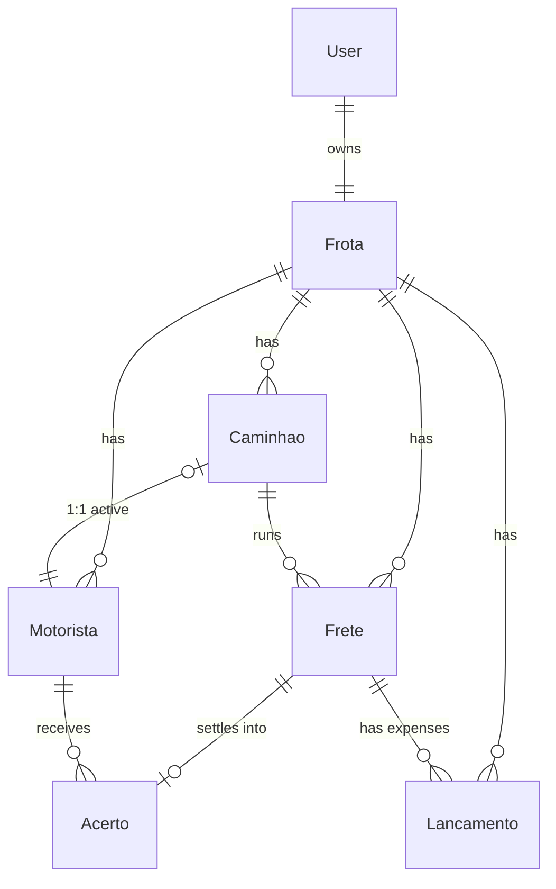

# Phase 1 Data Model: FreteAgro Web Platform

**Feature**: 001-frete-agro-saas | **Date**: 2026-06-08 | **Source**: spec.md Key Entities + provided Prisma schema

All monetary fields are **integer centavos**. Conversion to reais happens only at the display layer (`lib/finance/formatMoeda.ts`). Every table is subject to RLS scoped by fleet (see [research.md](./research.md) §2).

---

## Entity Overview



---

## 1. Frota (Fleet — tenant root)

| Field | Type | Notes |
|-------|------|-------|
| `id` | String (cuid) | PK |
| `nome` | String | Fleet name |
| `cnpjCpf` | String? | Optional tax id |
| `estado` | String | Operating state (UF) |
| `createdAt` | DateTime | default now |
| `ownerId` | String | FK → User, `@unique` (one fleet per owner) |

**Relationships**: `owner` (User 1:1), `caminhoes[]`, `motoristas[]`, `fretes[]`, `lancamentos[]`.

**Rules**: Tenant root. Every child row carries `frotaId`; RLS isolates by it (FR-008, SC-008).

## 2. Caminhao (Truck)

| Field | Type | Notes |
|-------|------|-------|
| `id` | String (cuid) | PK |
| `placa` | String | `@unique` |
| `modelo` | String | |
| `ano` | Int? | |
| `carroceria` | String? | `graneleiro \| tanque \| bau \| plataforma \| outro` |
| `status` | String | default `ativo`; `ativo \| inativo` |
| `frotaId` | String | FK → Frota |
| `motoristaId` | String? | FK → Motorista, **`@unique`** |
| `createdAt` | DateTime | default now |

**Relationships**: `frota`, `motorista?` (1:1), `fretes[]`.

**Rules**:
- **1 truck = 1 active driver** enforced by `motoristaId @unique` (DB) + `lib/` guard (FR-011, Principle IV). Attempting to bind an already-bound driver is blocked with an explanatory message.
- Inactivation (`status = inativo`) preserves history (FR-013).

**State transitions**: `ativo → inativo` (and back, if driver still free).

## 3. Motorista (Driver)

| Field | Type | Notes |
|-------|------|-------|
| `id` | String (cuid) | PK |
| `nome` | String | |
| `cpf` | String? | |
| `whatsapp` | String | invite channel (FR-006) |
| `percentualComissao` | Int | e.g. `12` = 12% |
| `tipoContrato` | String | default `autonomo`; `autonomo \| clt` |
| `status` | String | default `ativo`; `ativo \| inativo` |
| `appAtivado` | Boolean | default false; true after invite activation (FR-007) |
| `frotaId` | String | FK → Frota |
| `createdAt` | DateTime | default now |

**Relationships**: `frota`, `caminhao?` (back-relation of `Caminhao.motorista`), `acertos[]`.

**Rules**:
- Created exclusively by the owner; no self-registration (Principle IV, FR-010).
- `percentualComissao` is the configured default; per-freight variance handled via deductions/manual entries (Assumption).
- A snapshot of the percentual is copied into `Acerto.percentualComissao` at settlement time.

**State transitions**: `appAtivado: false → true` on activation; `status: ativo → inativo` preserves history.

## 4. Frete (Freight — central business unit)

| Field | Type | Notes |
|-------|------|-------|
| `id` | String (cuid) | PK |
| `origem` | String | |
| `destino` | String | |
| `tipoCarga` | String | `grao \| oleo_soja \| farelo \| fertilizante \| outro` |
| `kmInicial` | Int | |
| `kmFinal` | Int? | must be ≥ `kmInicial` when set (Edge Case) |
| `valorBruto` | Int | **centavos** |
| `status` | String | default `em_andamento`; `em_andamento \| concluido \| acerto_pendente \| acerto_realizado` |
| `dataInicio` | DateTime | |
| `dataFim` | DateTime? | |
| `frotaId` | String | FK → Frota |
| `caminhaoId` | String | FK → Caminhao |
| `createdAt` | DateTime | default now |

**Relationships**: `frota`, `caminhao`, `lancamentos[]`, `acerto?` (1:1).

**Rules**:
- Status lifecycle (FR-018): `em_andamento → concluido → acerto_pendente → acerto_realizado`.
- **Soft-delete only** when linked `lancamentos` or `acerto` exist (FR-020, Principle IV) — inactivate, never hard-delete.
- Driver derived through the bound `caminhao.motorista`.

**State transitions**:

```text
em_andamento --(km final + concluir)--> concluido
concluido --(abrir acerto)--> acerto_pendente
acerto_pendente --(confirmar pagamento)--> acerto_realizado
```

## 5. Lancamento (Expense / Cash-flow entry)

| Field | Type | Notes |
|-------|------|-------|
| `id` | String (cuid) | PK |
| `tipo` | String | `combustivel \| borracharia \| patio \| pedagio \| oficina \| vale \| adiantamento \| salario \| ipva \| seguro \| outro` |
| `descricao` | String? | |
| `valor` | Int | **centavos** |
| `fotoUrl` | String? | Supabase Storage URL (nota fiscal) |
| `deducaoAcerto` | Boolean | default false; if true, deducted from driver settlement |
| `freteId` | String? | FK → Frete (null for avulso cash entries) |
| `frotaId` | String | FK → Frota |
| `createdAt` | DateTime | default now |

**Relationships**: `frete?`, `frota`.

**Rules**:
- Expenses with `deducaoAcerto = true` linked to a freight sum into `Acerto.totalDeducoes` (FR-022, calc rule).
- Freight-less `Lancamento` rows represent avulso cash-flow outflows (FR-030).
- Photo uploads validated for MIME/type at the API boundary (Edge Case).

## 6. Acerto (Settlement — one per freight)

| Field | Type | Notes |
|-------|------|-------|
| `id` | String (cuid) | PK |
| `valorFrete` | Int | **centavos**; snapshot of freight value |
| `percentualComissao` | Int | snapshot at settlement time |
| `valorComissao` | Int | **centavos** = `Math.round(valorFrete × percentualComissao / 100)` |
| `totalDeducoes` | Int | **centavos** = Σ linked `Lancamento.valor` where `deducaoAcerto = true` |
| `saldoFinal` | Int | **centavos** = `valorComissao − totalDeducoes` (never rounded) |
| `status` | String | default `pendente`; `pendente \| realizado` |
| `comprovanteUrl` | String? | Supabase Storage PDF URL |
| `freteId` | String | FK → Frete, `@unique` (one settlement per freight) |
| `motoristaId` | String | FK → Motorista |
| `createdAt` | DateTime | default now |
| `realizadoEm` | DateTime? | set when confirmed |

**Relationships**: `frete` (1:1), `motorista`.

**Rules** (Principle IV, FR-021–FR-025, SC-002):
- `valorComissao = Math.round(valorFrete * percentualComissao / 100)` — the single intentional rounding point.
- `totalDeducoes` = exact integer sum of deduction lançamentos.
- `saldoFinal = valorComissao - totalDeducoes` — **never rounded**.
- One `Acerto` per `Frete` (`freteId @unique`); no partial settlements (Assumption).
- On confirm: `status → realizado`, set `realizadoEm`, set parent `Frete.status → acerto_realizado`.
- Concurrency: confirming an already-`realizado` acerto from a second device is rejected (Edge Case) — guard on `status` transition.

**State transitions**: `pendente → realizado` (terminal; editing a confirmed acerto requires an explicit reopen flow — Edge Case, out of initial scope).

## 7. User (Account — identity)

Identity record backing authentication (Supabase Auth + Next-Auth). Minimal app-side fields:

| Field | Type | Notes |
|-------|------|-------|
| `id` | String (cuid) | PK |
| `nome` | String | |
| `email` | String | `@unique` (FR-002) |
| `whatsapp` | String | |
| `role` | String | `dono \| motorista` |
| `createdAt` | DateTime | default now |

**Relationships**: owner of one `Frota` (when `role = dono`).

**Rules**: Email unique across platform (FR-002). Role drives routing: `dono → web panel`, `motorista → mobile app` (FR-006, FR-003).

---

## Validation Rules Summary (Zod, applied client + server)

| Entity | Key validations |
|--------|-----------------|
| User/cadastro | email format + unique; senha min length; whatsapp mask; estado required |
| Caminhao | placa format (Mercosul/legacy) + unique; carroceria ∈ enum; status ∈ enum |
| Motorista | whatsapp required; `percentualComissao` 0–100 int; tipoContrato/status ∈ enum |
| Frete | `kmFinal ≥ kmInicial` when present; `valorBruto ≥ 0` int; tipoCarga/status ∈ enum |
| Lancamento | `valor ≥ 0` int; tipo ∈ enum; fotoUrl MIME-validated upload |
| Acerto | derived/computed in `lib/finance`; not user-typed except deduction items |

## Derived / Computed Values (never user-entered)

- `Acerto.valorComissao`, `Acerto.totalDeducoes`, `Acerto.saldoFinal` → computed in `lib/finance/calcularAcerto.ts`.
- Freight `totalDespesas` (display) → sum of linked `Lancamento.valor`.
- Caixa lucro líquido → `Σ receitas − Σ todas despesas` in `lib/finance/calcularCaixa.ts` (FR-031).
- Dashboard KPIs → aggregated server-side, cached `revalidate = 300`.
