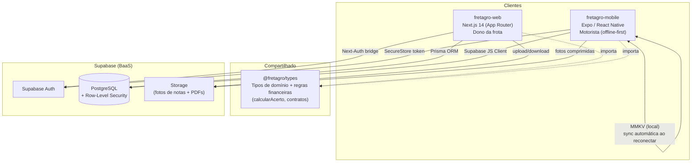
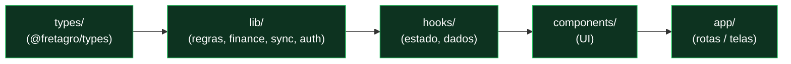
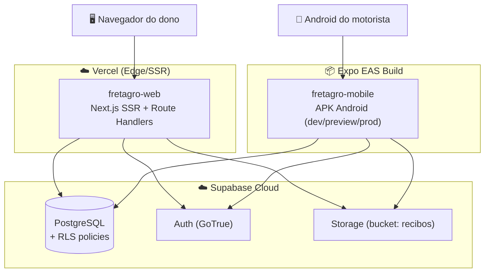
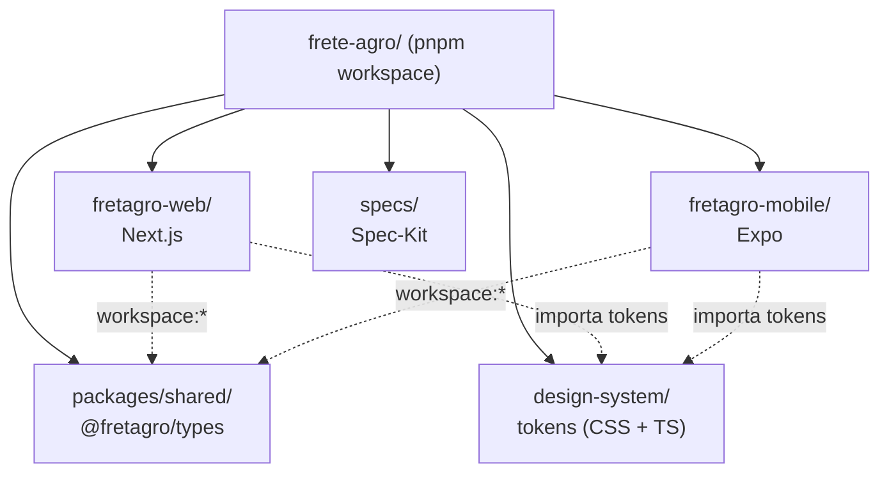
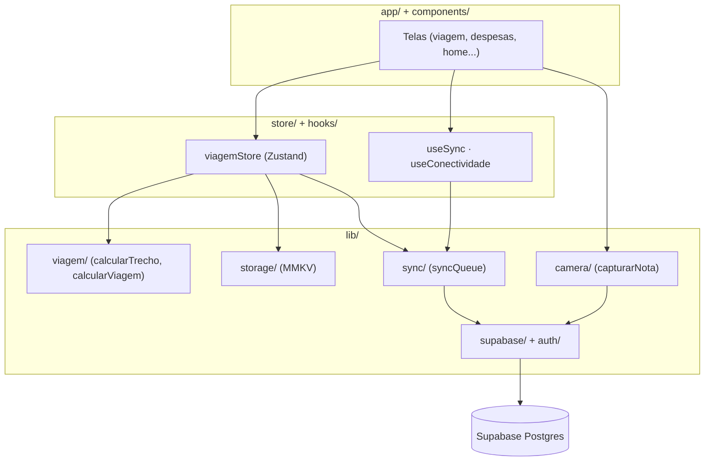
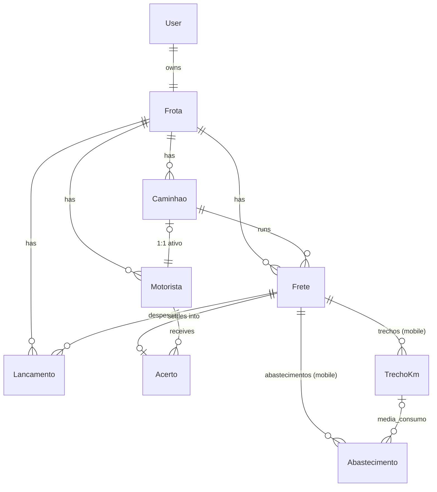
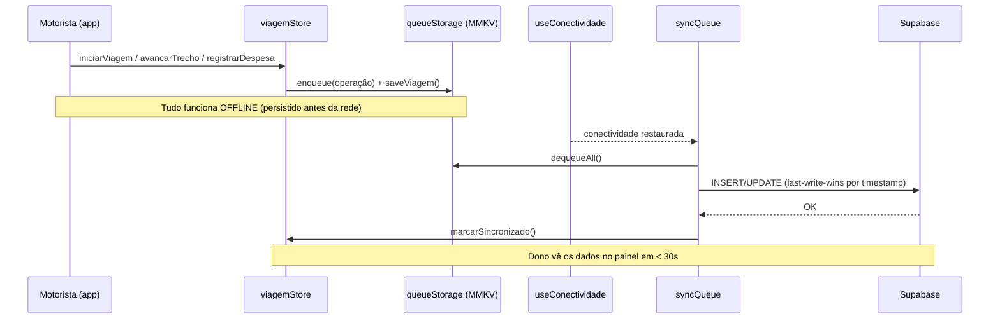

# Análise e Projeto do Software

Esta página descreve o **projeto arquitetural**, o **projeto de componentes** e as **propriedades de projeto** do FreteAgro, com os diagramas correspondentes.

---

## 1. Projeto Arquitetural

### 1.1 Estilo arquitetural

O FreteAgro adota uma arquitetura **monorepo multi-plataforma** com três características centrais:

1. **Cliente-servidor com backend gerenciado (BaaS).** O backend é o **Supabase** (PostgreSQL + Auth + Storage). Não há um servidor de aplicação dedicado: a web usa *Route Handlers* do Next.js como camada de API, e o mobile fala direto com o Supabase (via camada `lib/sync`).
2. **Offline-first no cliente mobile.** O app funciona sem rede, persistindo em **MMKV** e sincronizando de forma assíncrona. É um estilo **local-first com sincronização eventual** e resolução de conflitos *last-write-wins*.
3. **Contratos compartilhados.** Um pacote **`@fretagro/types`** (zero-dependency) centraliza tipos de domínio e regras financeiras, consumido por web e mobile — garantindo **fonte única de verdade**.

### 1.2 Diagrama de Arquitetura (visão de alto nível)



### 1.3 Fluxo de dados chave (direção de escrita)

Um ponto de projeto importante é que **cada plataforma é dona de um subconjunto dos dados**:

| Dado | Escrito por | Lido por |
|------|-------------|----------|
| Frota, motoristas, caminhões | **Web** (dono) | Web + Mobile |
| Fretes, acertos, caixa | **Web** (dono) | Web + Mobile (acerto: read-only) |
| `TrechoKm`, `Abastecimento` | **Mobile** (motorista) | Web + Mobile |

Isso elimina conflitos de escrita concorrente na maioria dos casos: o motorista escreve dados de campo; o dono escreve dados de gestão. O modelo `Acerto` é **calculado exclusivamente na web** e apenas **exibido** (read-only) no mobile.

### 1.4 Arquitetura em camadas (dentro de cada app)

A constituição do projeto impõe um **fluxo de dependência unidirecional**. Uma camada só pode importar da camada imediatamente "abaixo":



**Regra:** `types → lib → hooks → components → app`. Nenhuma seta volta. Isso mantém a **lógica de negócio testável isoladamente** (em `lib/`, sem depender de UI) e evita acoplamento circular.

### 1.5 Diagrama de Implantação (Deployment)



---

## 2. Projeto de Componentes (módulos)

### 2.1 Diagrama de Pacotes (monorepo)



### 2.2 Componentes/módulos do sistema

#### `packages/shared` — `@fretagro/types`
Pacote TypeScript zero-dependency, fonte única de verdade do domínio.
- `types/`: `frota`, `frete`, `viagem` (`TrechoKm`, `Abastecimento`, `ViagemAtiva`), `acerto`, `auth`.
- `lib/finance/calcularAcerto.ts`: a **fórmula do acerto** vive aqui (escrita pela web, lida pelo mobile).

#### `fretagro-web` — Painel do dono (camadas)
| Módulo | Responsabilidade |
|--------|------------------|
| `app/(auth)/` | Login, cadastro, recuperação de senha |
| `app/(dashboard)/` | Dashboard, frota, fretes, acertos, caixa, relatórios |
| `app/api/` | Route Handlers (REST): auth, caminhoes, motoristas, fretes, acertos, caixa, relatorios |
| `lib/finance/` | `calcularAcerto`, `calcularCusto`, `calcularCaixa`, `formatMoeda` |
| `lib/auth/` | Config Next-Auth ↔ Supabase, schemas |
| `lib/db/` | Cliente Prisma (singleton) + clientes Supabase (ssr) |
| `hooks/` | `useFrota`, `useFretes`, `useAcertos`, `useCaixa`, `useDashboard` |
| `components/` | `ui/` (Shadcn), `layout/`, `auth/`, `frota/`, `fretes/`, `acertos/`, `dashboard/`, `shared/` |

#### `fretagro-mobile` — App do motorista (camadas)
| Módulo | Responsabilidade |
|--------|------------------|
| `app/(auth)/` | Login, ativação por deep link |
| `app/(app)/` | Home, viagem (iniciar/em-curso/avançar/encerrar/resumo), despesas, histórico, acerto, perfil |
| `lib/viagem/` | `calcularTrecho`, `calcularViagem` (km, média de consumo, imutabilidade) |
| `lib/sync/` | `syncViagem`, `syncDespesas`, `syncQueue` (fila de sincronização) |
| `lib/storage/` | `viagemStorage`, `queueStorage` (persistência MMKV) |
| `lib/camera/` | `capturarNota` (foto + compressão + upload) |
| `lib/supabase/` + `lib/auth/` | Cliente Supabase + `mobileAuth` (único ponto de auth) |
| `store/viagemStore.ts` | Estado global da viagem ativa (Zustand) |
| `hooks/` | `useViagemAtiva`, `useConectividade`, `useSync`, `useAcerto` |

### 2.3 Diagrama de Componentes — App Mobile (offline-first)



### 2.4 Diagrama de Classes / Modelo de Dados (ER)



Todas as tabelas carregam `frotaId` e são isoladas por **RLS**. Campos monetários são **inteiros em centavos**.

### 2.5 Sequência — Sincronização offline → online



---

## 3. Sketches

> 🔧 **(Opcional)** Se o grupo desenhou wireframes/sketches antes de implementar (ex.: fluxo da viagem no mobile ou layout do dashboard), insira as imagens aqui e descreva **em que momento** foram necessárias.
>
> Exemplo de descrição: *"O sketch do fluxo de trechos (vazio → carregado → vazio) foi desenhado durante a fase `/plan` do mobile, quando percebemos que 'km inicial/final' simples não capturava a média de consumo por trecho. O sketch guiou a modelagem de `TrechoKm`."*

O design system compartilhado (**Rayna UI v1.0**), documentado em `design-system/DESIGN_SYSTEM.md`, funcionou como *design tokens* de referência (paleta dark, tipografia Inter, raios de borda), garantindo consistência visual entre web e mobile sem redesenhar componentes.

---

## 4. Propriedades de Projeto

Esta seção discute propriedades de projeto adotadas, com trechos de código reais do sistema.

### 4.1 Fonte única de verdade para dinheiro (aritmética em centavos)

**Propriedade:** todo valor monetário é um **inteiro em centavos**; a conversão para reais acontece **num único lugar** (camada de exibição). Isso elimina erros de ponto flutuante em dinheiro.

```typescript
// packages/shared/lib/finance/calcularAcerto.ts
// Único ponto de arredondamento da comissão (constituição, Princípio IV).
export function calcularComissao(valorFrete: number, percentualComissao: number): number {
  return Math.round((valorFrete * percentualComissao) / 100)
}

// saldoFinal NÃO sofre arredondamento adicional — precisão exata.
export function calcularSaldoFinal(valorComissao: number, totalDeducoes: number): number {
  return valorComissao - totalDeducoes
}
```

```typescript
// fretagro-web/lib/finance/formatMoeda.ts
// ÚNICO lugar que converte centavos → reais para exibição.
export function formatMoeda(centavos: number): string {
  return BRL_FORMATTER.format(centavos / 100) // Intl.NumberFormat pt-BR / BRL
}
```

**Benefício:** o critério de sucesso SC-002 ("cálculo 100% preciso") é atendido por construção — não há arredondamento espalhado pelo código.

### 4.2 Reuso / DRY via pacote compartilhado

**Propriedade:** a regra financeira **não é duplicada**. `calcularAcerto` vive em `packages/shared` e é importada por web e mobile:

```typescript
// Tanto fretagro-web quanto fretagro-mobile importam do mesmo pacote:
import { calcularComissao, calcularSaldoFinal } from '@fretagro/types'
```

**Benefício:** uma mudança na fórmula do acerto se propaga automaticamente para as duas plataformas.

### 4.3 Separação de responsabilidades por camadas

**Propriedade:** cada arquivo declara sua camada e proíbe importações "de cima". Exemplo real no cabeçalho da lógica financeira:

```typescript
// lib/finance/calcularAcerto.ts
// Layer: lib — no imports from hooks/, components/, or app/
```

**Benefício:** a lógica de negócio é **testável isoladamente** (Vitest/Jest em `lib/`), sem montar UI. Ver [Testes e Qualidade](Testes-e-Qualidade).

### 4.4 Offline-first: persistência antes da rede

**Propriedade:** no mobile, **toda mutação persiste em MMKV antes** de qualquer chamada de rede, e enfileira a operação para sincronização posterior. A rede é sempre tratada como **opcional**.

```
Ação do motorista → viagemStore (mutação) → queueStorage.enqueue()
                                          → viagemStorage.saveViagem()
                     (só depois, quando houver rede) → syncQueue → Supabase
```

**Benefício:** SC-002 mobile ("zero dependência de rede para ações de campo") é garantido; nenhum dado se perde em área sem sinal.

### 4.5 Segurança por padrão (multi-tenant + segredos)

**Propriedades:**
- Isolamento entre frotas garantido no banco por **Row-Level Security** (`USING (frota_id = current_setting('app.current_frota_id'))`), reforçado por guards em `lib/` (defesa em profundidade).
- Restrição **1 caminhão = 1 motorista** no banco (`motoristaId @unique`) **e** na `lib/` (`vincularMotorista.ts`).
- Token de auth do motorista **apenas** em `expo-secure-store`; nunca em MMKV/AsyncStorage.
- `service_role` do Supabase isolada em caminho server-only na web.

**Benefício:** o critério SC-008 ("zero acesso cruzado entre frotas") é atendido em **duas camadas** independentes.
