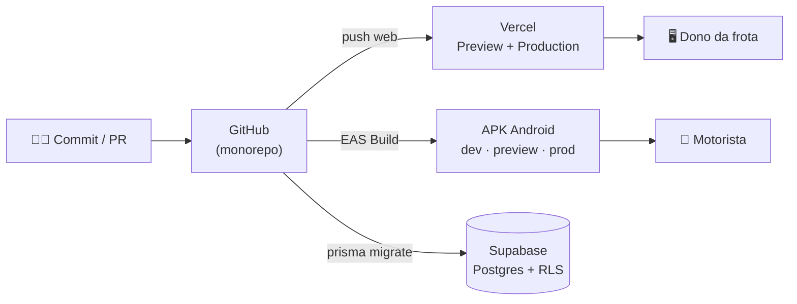
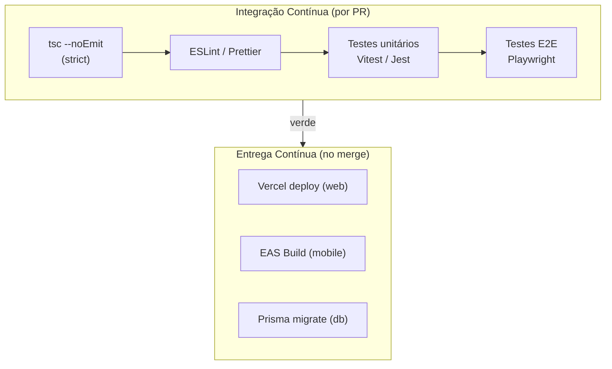
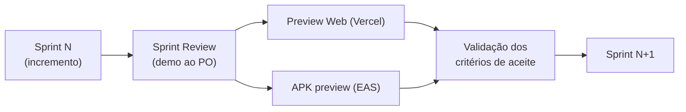

# DevOps

Esta página descreve o **processo de implantação/entrega** durante o desenvolvimento e as **práticas de CI/CD** adotadas no FreteAgro.

---

## 1. Ambientes e Implantação

O sistema tem dois artefatos implantáveis, cada um com seu pipeline:

| Aplicação | Plataforma de deploy | Artefato |
|-----------|----------------------|----------|
| `fretagro-web` | **Vercel** (SSR/Edge) | Deploy contínuo a partir do Git |
| `fretagro-mobile` | **Expo EAS Build** | APK Android (dev / preview / production) |
| Backend | **Supabase Cloud** | PostgreSQL + Auth + Storage (migrações Prisma) |



### 1.1 Web — Vercel

- **Preview automático por Pull Request:** cada PR gera uma URL de preview isolada, permitindo revisão visual antes do merge.
- **Deploy de produção no merge para a branch principal.**
- Variáveis de ambiente (`DATABASE_URL`, chaves Supabase, `NEXTAUTH_SECRET`, etc.) gerenciadas no painel da Vercel — nenhum segredo no repositório (`.env.example` documenta as chaves).

### 1.2 Mobile — Expo EAS Build

O `fretagro-mobile/eas.json` define **três perfis de build**:

| Perfil | Distribuição | Build | Uso |
|--------|-------------|-------|-----|
| `development` | interna | APK debug (`assembleDebug`, dev client) | Desenvolvimento com hot reload |
| `preview` | interna | APK release (`assembleRelease`) | Testes internos / QA em dispositivo real |
| `production` | store | Bundle release (`bundleRelease`) | Distribuição final |

Comandos típicos:

```bash
# Build interno para QA
eas build --profile preview --platform android

# Build de produção
eas build --profile production --platform android
```

### 1.3 Banco de Dados — Migrações versionadas

O schema é gerenciado com **Prisma Migrate**; cada alteração gera uma migração versionada em `fretagro-web/prisma/migrations/`. As **políticas RLS** são aplicadas via `prisma/rls-policies.sql`.

```bash
npx prisma migrate dev --name <descricao>   # cria + aplica migração
npx prisma generate                          # regenera o client tipado
```

> Exemplo real: a feature mobile adicionou os modelos `TrechoKm` e `Abastecimento` de forma **aditiva** (migração `add_trecho_km_abastecimento`), sem alterar tabelas existentes — política de mudança segura de schema.

---

## 2. Práticas de CI/CD



### 2.1 Quality Gates como CI

Cada PR precisa passar pelos gates automatizáveis antes do merge (a mesma *Definition of Done* de [Testes e Qualidade](Testes-e-Qualidade)):

```bash
# Web
pnpm --filter fretagro-web tsc
pnpm --filter fretagro-web lint
pnpm --filter fretagro-web test
pnpm --filter fretagro-web test:e2e

# Mobile
pnpm --filter fretagro-mobile tsc
pnpm --filter fretagro-mobile test

# Shared
pnpm --filter @fretagro/types test
```

### 2.2 Práticas adotadas

| Prática | Como é aplicada |
|---------|-----------------|
| **Trunk/branch por feature** | Branches `001-frete-agro-saas`, `002-fretagro-mobile`; merge via PR |
| **Preview environments** | Vercel gera preview por PR (web) |
| **Build reproduzível** | `pnpm` com lockfile + EAS profiles versionados |
| **Migrações versionadas** | Prisma Migrate; schema evolui de forma aditiva e rastreável |
| **Gestão de segredos** | Variáveis fora do repo (Vercel/EAS/Supabase); `.env.example` documenta |
| **Monorepo com workspaces** | `pnpm-workspace.yaml` — um `pnpm install` resolve web + mobile + shared |
| **Entrega incremental por sprint** | A cada sprint, um incremento testável é publicado (preview web + APK preview) |

### 2.3 Entrega ao fim de cada sprint



> 🔧 **DICA:** insira aqui um print do **dashboard da Vercel** (histórico de deploys) e da **página de builds do EAS** para evidenciar visualmente o processo de entrega ao fim de cada sprint.

``
``

---

## 3. Possíveis evoluções de DevOps (roadmap)

- **GitHub Actions** para rodar os Quality Gates automaticamente em cada PR (matriz web + mobile).
- **EAS Submit** para publicação automática na Play Store no perfil `production`.
- **Preview de banco** por PR (branching de banco do Supabase) para E2E isolados.
- **Monitoramento** (Sentry / Vercel Analytics) para observabilidade em produção.
