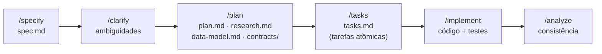
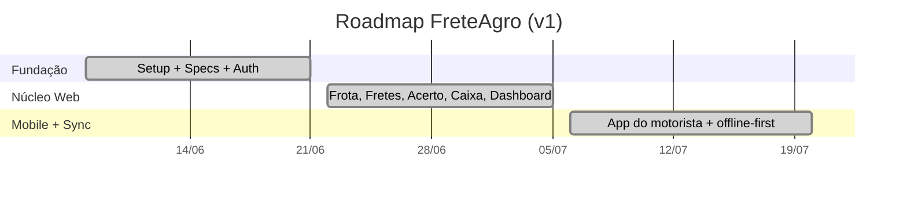
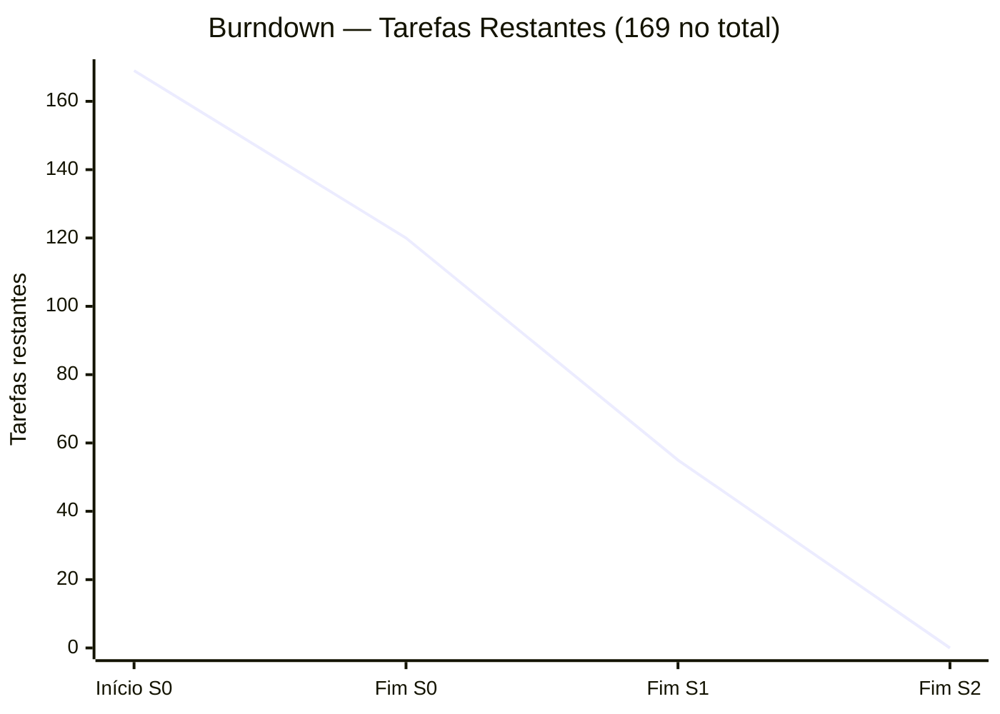

# Gestão do Projeto

Esta página descreve **como** o FreteAgro foi conduzido: metodologia, papéis da equipe, números do projeto, cerimônias, transbordos de tarefas e a comparação entre backlog inicial e final.

> 🔧 **Ação necessária:** os campos marcados com `⟨preencher⟩` (nomes de integrantes, datas exatas de cerimônias, prints do Jira) devem ser ajustados com os dados reais do seu grupo antes de publicar. Todo o restante já está preenchido com base no histórico real do repositório e das especificações Spec-Kit.

---

## 1. Metodologia de Desenvolvimento

O projeto adotou uma metodologia **ágil, iterativa e incremental**, combinando **Scrum** com o fluxo **Spec-Driven Development (Spec-Kit)**. A escolha se justifica pela natureza do produto — dois aplicativos que compartilham domínio — em que **especificar antes de codar** reduz retrabalho e ambiguidade.

### 1.1 Scrum adaptado

- **Sprints** de duração fixa (2 semanas), cada uma entregando um incremento funcional e testável.
- **Backlog priorizado** por valor de negócio e dependência técnica (prioridades P1–P8 nas histórias).
- **Definition of Done (DoD)** ancorada em *Quality Gates* objetivos (ver seção 6): zero erros de tipo, lint limpo, testes passando e história testável de forma independente.
- Cada história foi desenhada para ser **entregue e testada de forma independente** (*Independent Test* explícito em cada user story).

### 1.2 Spec-Driven Development (Spec-Kit)

Antes de qualquer código, cada funcionalidade passou por um pipeline de artefatos versionados em `specs/`:

Cada feature branch (`001-frete-agro-saas`, `002-fretagro-mobile`) produziu:
`spec.md` (requisitos) → `plan.md` (arquitetura) → `research.md` (decisões técnicas) → `data-model.md` (entidades) → `contracts/` (contratos de API/telas) → `tasks.md` (tarefas atômicas rastreáveis) → `checklists/` (revisão de qualidade).

Essa abordagem trouxe **rastreabilidade total**: cada tarefa em `tasks.md` referencia o requisito funcional (FR-xxx) que a originou.

---

## 2. Papéis da Equipe

> ⚠️ Ajuste os nomes conforme seu grupo. **Pelo menos um integrante exerce o papel de Product Owner (PO).**

| Integrante | Papel principal | Responsabilidades |
|-----------|-----------------|-------------------|
| ⟨Nome 1⟩ | **Product Owner (PO)** | Dono do backlog e das prioridades; escreve/valida as histórias e critérios de aceite; representa o usuário (dono de frota / motorista); aprova o *Definition of Done*; conduz a *Sprint Review*. |
| ⟨Nome 2⟩ | **Scrum Master / Tech Lead** | Facilita cerimônias; remove impedimentos; guardião da arquitetura em camadas e dos *Quality Gates*; revisa PRs. |
| ⟨Nome 3⟩ | **Dev Frontend Web** | Implementação do painel `fretagro-web` (Next.js, Shadcn/UI, dashboards, relatórios). |
| ⟨Nome 4⟩ | **Dev Mobile** | Implementação do app `fretagro-mobile` (Expo, offline-first, sincronização). |
| ⟨Nome 5⟩ | **Dev Backend / Dados** | Modelagem Prisma, RLS, contratos de API, lógica financeira em `packages/shared`. |
| ⟨Nome 6⟩ | **QA / DevOps** | Testes (Vitest, Playwright, Jest), cobertura, pipeline de build (Vercel, EAS). |

> 💡 Em grupos menores, um integrante acumula papéis. Registre aqui a distribuição real. O importante é que o papel de **PO** esteja claramente atribuído a **um** integrante.

---

## 3. Números do Projeto (descrição quantitativa)

> Os números abaixo derivam do histórico real do repositório e dos artefatos Spec-Kit. Ajuste datas de cerimônias conforme os registros do seu grupo/Jira.

| Métrica | Valor |
|---------|-------|
| **Kick-off** | 08/06/2026 (criação da spec `001` + *Initial commit*) |
| **Encerramento (v1)** | 20/07/2026 (último commit da entrega) |
| **Duração total** | ~6 semanas |
| **Total de Sprints** | 3 sprints de 2 semanas |
| **Features especificadas (Spec-Kit)** | 2 (`001-frete-agro-saas`, `002-fretagro-mobile`) |
| **Histórias de usuário** | 15 (7 web + 8 mobile) |
| **Requisitos funcionais** | 41 (web) + 36 (mobile) |
| **Tarefas planejadas (tasks.md)** | **169** (101 web + 68 mobile) |
| **Tarefas concluídas** | **169 / 169 (100%)** |
| **Fases de execução** | 10 (web) + 12 (mobile) |
| **Modelos de dados (Prisma)** | 9 (7 base + `TrechoKm` + `Abastecimento`) |
| **Telas (aprox.)** | ~11 rotas web + ~8 telas mobile |

### 3.1 Cronograma de Sprints

| Sprint | Período | Objetivo (incremento) | Entregas |
|--------|---------|-----------------------|----------|
| **Sprint 0 — Fundação** | 08/06 – 21/06 | Setup do monorepo, design system, especificações Spec-Kit, esquema Prisma + RLS, auth e onboarding | US-W1 (P1), infraestrutura compartilhada |
| **Sprint 1 — Núcleo Web** | 22/06 – 05/07 | Gestão de frota, fretes, **acerto financeiro**, caixa e dashboard | US-W2 a US-W6 |
| **Sprint 2 — Mobile + Sync** | 06/07 – 20/07 | App do motorista completo, offline-first, sincronização e polimento | US-W7, US-M1 a US-M8 |

> 🔧 Substitua por um **Gantt/roadmap exportado do Jira** para enriquecer a seção.

---

## 4. Cerimônias

| Cerimônia | Frequência | Objetivo |
|-----------|-----------|----------|
| **Sprint Planning** | Início de cada sprint | Selecionar histórias do backlog priorizado e quebrar em tarefas (`tasks.md`). |
| **Daily Standup** | Diária (assíncrona) | Sincronizar progresso e impedimentos. |
| **Sprint Review** | Fim de cada sprint | Demonstrar o incremento ao PO; validar critérios de aceite. |
| **Sprint Retrospective** | Fim de cada sprint | Discutir o que manter/melhorar no processo. |
| **Backlog Refinement** | Contínuo | Refinar histórias futuras via `/clarify` e `/analyze` do Spec-Kit. |

> 🔧 Registre datas e participantes reais de cada cerimônia (exporte do Jira, se aplicável).

---

## 5. Gráfico Burndown

> 🔧 **Ação necessária:** insira aqui os **gráficos burndown exportados do Jira** (um por sprint). Abaixo, um burndown ilustrativo baseado nas 169 tarefas concluídas ao longo de 3 sprints — substitua pelo real.

**Burndown do projeto (tarefas restantes por sprint):**

| Marco | Tarefas restantes | Concluídas na sprint |
|-------|:----------------:|:--------------------:|
| Início Sprint 0 | 169 | — |
| Fim Sprint 0 | 120 | 49 (setup + fundação + US-W1) |
| Fim Sprint 1 | 55 | 65 (núcleo web) |
| Fim Sprint 2 | 0 | 55 (mobile + polimento) |

> A linha real (do Jira) provavelmente terá degraus e platôs — comente na seção 6 quaisquer desvios entre a linha ideal e a real.

---

## 6. Transbordos de Tarefas (Spillover)

**Houve transbordos pontuais**, tratados de forma controlada:

- **Suporte de API ao mobile (US-W7)** foi originalmente planejado para a Sprint 1 (junto ao núcleo web), mas **transbordou para a Sprint 2**. Motivo: os modelos `TrechoKm` e `Abastecimento` só puderam ser finalizados quando o contrato de sincronização do app ficou estável. A decisão de mover foi consciente — evitou implementar uma API "às cegas" antes de o consumidor (mobile) existir.
- **Testes E2E adicionais** (paginação, isolamento de tenant) foram refinados na fase de *Polish*, transbordando do fechamento de cada história para a fase final de cada feature.
- **iOS** foi formalmente movido para fora do escopo v1 (Fase 2) já no planejamento, evitando transbordo de esforço sobre uma plataforma não prioritária.

**Lição:** os transbordos ocorreram majoritariamente em **tarefas de integração entre plataformas**, onde a dependência entre web e mobile é maior. Antecipar os **contratos compartilhados** (`@fretagro/types`) reduziu, mas não eliminou, esse acoplamento temporal.

---

## 7. Backlog: Inicial × Final

### 7.1 Backlog Inicial (planejado no kick-off)

Definido nas specs `spec.md` no início de cada feature:

**Web (7 histórias):** Autenticação/Onboarding · Gestão da Frota · Registro de Fretes · Acerto Financeiro · Caixa da Frota · Dashboard/Relatórios · Suporte de API ao Mobile.

**Mobile (8 histórias):** Ativação/Login · Registrar Viagem · Registrar Despesas · Offline/Sync · Histórico · Meu Acerto · Home · Perfil.

### 7.2 Backlog Final (executado)

| História | Planejado | Executado | Observação |
|----------|:---------:|:---------:|-----------|
| US-W1 Autenticação/Onboarding | ✅ | ✅ | — |
| US-W2 Gestão da Frota | ✅ | ✅ | — |
| US-W3 Registro de Fretes | ✅ | ✅ | — |
| US-W4 Acerto Financeiro | ✅ | ✅ | Diferencial central, cálculo em centavos exato |
| US-W5 Caixa da Frota | ✅ | ✅ | — |
| US-W6 Dashboard/Relatórios | ✅ | ✅ | Exportação PDF + Excel |
| US-W7 Suporte de API ao Mobile | ✅ | ✅ | Transbordou p/ Sprint 2 |
| US-M1 Ativação/Login | ✅ | ✅ | — |
| US-M2 Registrar Viagem | ✅ | ✅ | Modelo de trechos (vazio/carregado) |
| US-M3 Registrar Despesas | ✅ | ✅ | — |
| US-M4 Offline/Sync | ✅ | ✅ | Restrição central; last-write-wins |
| US-M5 Histórico | ✅ | ✅ | — |
| US-M6 Meu Acerto | ✅ | ✅ | Somente-leitura no app |
| US-M7 Home | ✅ | ✅ | — |
| US-M8 Perfil | ✅ | ✅ | — |

### 7.3 Análise: o planejado foi executado?

> **Sim — 100% do backlog planejado foi executado.** As 15 histórias e as 169 tarefas foram concluídas.

O que **mudou entre o inicial e o final** não foi *o que* foi entregue, mas **detalhes de escopo refinados durante a execução** via `/clarify`:

- **`valorBruto` da viagem tornou-se opcional** no app (o motorista pode não ter a Carta Frete na partida; o dono completa depois na web). Refinamento originado de um edge case identificado no `/clarify`.
- O **modelo de trechos de km** (vazio → carregado → vazio) foi detalhado durante o `data-model` do mobile, mais rico do que o "km inicial/final" simples imaginado no início.
- **iOS** foi explicitamente adiado para Fase 2 (não era escopo v1).

Nenhum item planejado foi **cortado**; os ajustes foram **refinamentos de detalhe**, não remoções — o que evidencia a maturidade do planejamento Spec-Driven.

---

## 8. Ferramentas de Gestão

| Ferramenta | Uso |
|-----------|-----|
| **Jira** | Backlog, sprints, quadro Kanban, burndown. *(Exporte prints/gráficos para enriquecer esta página.)* |
| **GitHub** | Repositório, branches por feature, Pull Requests, code review, Wiki. |
| **Spec-Kit** | Especificação dirigida (`/specify`, `/plan`, `/tasks`, `/implement`, `/analyze`). |
| **GitHub Projects** *(opcional)* | Alternativa/complemento ao Jira para acompanhamento. |

> 🔧 **DICA da avaliação:** exporte figuras do Jira (roadmap, burndown, quadro de sprint, distribuição de tarefas) e insira-as nesta seção para enriquecer a documentação de gestão.
