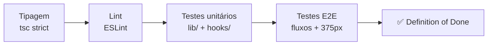
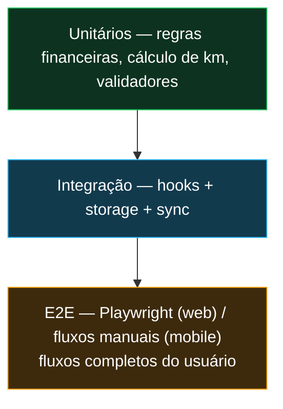

# Testes e Qualidade

Esta página descreve **como o FreteAgro foi testado**, quais **ferramentas** foram usadas e a **cobertura** alcançada.

---

## 1. Estratégia de Testes

A qualidade é garantida por **Quality Gates objetivos** (herdados da constituição do projeto) que compõem a *Definition of Done* de cada história. Nada é considerado "pronto" sem passar por todos eles.



A pirâmide de testes concentra esforço na **lógica de negócio** (`lib/`), onde vivem as regras críticas (finanças, cálculo de trechos, imutabilidade), e usa **E2E** para validar os fluxos ponta a ponta do usuário.



---

## 2. Ferramentas e Bibliotecas

| Camada | Ferramenta | Uso |
|--------|-----------|-----|
| **Web — unitário** | **Vitest** | Testa `lib/finance/*`, `lib/utils/*` e hooks |
| **Web — E2E** | **Playwright** | Fluxos completos + snapshot mobile a **375 px** (Gate 5) |
| **Mobile — unit/integração** | **Jest** + **React Native Testing Library** | Testa `lib/viagem`, `lib/storage`, `lib/sync` e hooks |
| **Shared** | **Vitest / Jest** | Testa a regra financeira `calcularAcerto` |
| **Tipagem** | **TypeScript strict (`tsc --noEmit`)** | Zero erros de tipo é um gate obrigatório |
| **Lint** | **ESLint + Prettier** | Regra de "nenhum hex hardcoded" + disciplina de imports por camada |
| **Cobertura** | **Vitest coverage** (web) / **Jest coverage** (mobile) | Relatórios `lcov` / `clover` |

---

## 3. Suítes de Teste Implementadas

### 3.1 Web — Testes unitários (Vitest)

| Arquivo | O que valida |
|---------|--------------|
| `lib/finance/calcularAcerto.test.ts` | Comissão e saldo líquido em centavos; ponto único de arredondamento |
| `lib/finance/calcularCaixa.test.ts` | Consolidação de entradas/saídas e lucro líquido |
| `lib/finance/formatMoeda.test.ts` | Conversão centavos → BRL (incluindo negativos e zero) |
| `lib/utils/validators.test.ts` | Máscaras e validadores (placa Mercosul/legada, WhatsApp, UF) |

### 3.2 Web — Testes E2E (Playwright)

| Arquivo | Fluxo coberto |
|---------|---------------|
| `e2e/auth.spec.ts` | Cadastro → login → boas-vindas guiadas → redirect de rota protegida (+375px) |
| `e2e/frota.spec.ts` | Criar caminhão/motorista → vincular → bloqueio de vínculo duplo |
| `e2e/fretes.spec.ts` | Registro de frete + despesas + ciclo de status |
| `e2e/acertos.spec.ts` | Acerto: comissão + deduções + saldo + comprovante |
| `e2e/caixa.spec.ts` | Extrato do caixa e lucro líquido |
| `e2e/dashboard.spec.ts` | KPIs, gráficos e filtros de período |
| `e2e/mobile-sync.spec.ts` | Dados do app aparecem no painel do dono |
| `e2e/pagination.spec.ts` | Paginação server-side (listas > 50) |
| `e2e/tenant-isolation.spec.ts` | **Isolamento entre frotas** (zero acesso cruzado, SC-008) |

### 3.3 Mobile — Testes unitários/integração (Jest + RNTL)

| Arquivo | O que valida |
|---------|--------------|
| `__tests__/lib/viagem/calcularTrecho.test.ts` | `km_rodado`, imutabilidade de trecho fechado, bloqueio de trecho aberto |
| `__tests__/lib/viagem/calcularViagem.test.ts` | Totais de km (vazio/carregado) e média de consumo (diesel) |
| `__tests__/lib/storage/viagemStorage.test.ts` | Persistência da viagem ativa em MMKV |
| `__tests__/lib/storage/queueStorage.test.ts` | Fila de sincronização (enqueue/dequeue) |
| `__tests__/lib/sync/syncQueue.test.ts` | Sincronização e resolução de conflito (last-write-wins) |
| `__tests__/hooks/useConectividade.test.ts` | Detecção de conectividade |
| `__tests__/hooks/useViagemAtiva.test.ts` | Estado da viagem ativa |
| `__tests__/hooks/useSync.test.ts` | Disparo automático de sincronização |
| `__tests__/hooks/useAcerto.test.ts` | Saldo/acerto (read-only) |

### 3.4 Shared

| Arquivo | O que valida |
|---------|--------------|
| `packages/shared/__tests__/calcularAcerto.test.ts` | Regra financeira compartilhada (fonte única de verdade) |

---

## 4. Cobertura de Testes

A cobertura é medida por **duas suítes complementares**: os **testes unitários** (Vitest/Jest) medem a cobertura da lógica de negócio em `lib/`, e os **testes E2E** (Playwright) exercitam o restante do código (rotas, componentes, handlers de API) — cobertura essa que **não é contabilizada** pela ferramenta de cobertura unitária.

### 4.1 Web (relatório real — `fretagro-web/coverage/`)

**62 testes unitários passando** em 4 arquivos. A cobertura unitária foca deliberadamente no **núcleo financeiro e de validação** (a lógica que, se falhar, gera prejuízo direto):

| Módulo | % Statements | Observação |
|--------|:-----------:|-----------|
| `lib/finance/calcularAcerto.ts` | **100%** | Regra do acerto (comissão/saldo) |
| `lib/finance/formatMoeda.ts` | **100%** | Conversão centavos → BRL |
| `lib/finance/calcularCaixa.ts` | **96,77%** | Consolidação do caixa |
| `lib/utils/validators.ts` | **100%** | Máscaras e validadores |
| `lib/finance` (pasta) | **~78,87%** | Núcleo financeiro |
| **Todos os arquivos (`All files`)** | **~4,58%** | Ver nota abaixo ⬇️ |

> ⚠️ **Por que "All files" é baixo (4,58%)?** O `vitest.config.ts` inclui **todo** o `lib/**` e `hooks/**` no denominador da cobertura, mas a maioria desses módulos (handlers de API, PDF, Excel, dashboard, auth) é validada pelos **testes E2E do Playwright**, que não são medidos pela cobertura do Vitest. Ou seja: **o número baixo não significa código sem teste** — significa que a validação está no E2E. A cobertura *unitária* onde ela é aplicada (finanças/validação) é de **~79% a 100%**.

### 4.2 Mobile (relatório real — `fretagro-mobile/coverage/`)

| Métrica | Cobertura |
|---------|:---------:|
| **Statements** | **~65,7%** (151/230) |

A cobertura mobile concentra-se nas áreas de **maior risco**: cálculo de trechos/viagem (`lib/viagem`), persistência offline (`lib/storage`) e sincronização (`lib/sync`) — exatamente a lógica que, se falhar, corrompe dados de campo. As telas (`app/`) têm cobertura menor por serem majoritariamente composição de componentes já testados.

### 4.3 Como gerar os relatórios

> ⚠️ Execute sempre a partir da **raiz do monorepo** (`frete-agro/`). Rodar de dentro de `fretagro-web/` falha ao resolver `@fretagro/types`.

```bash
# Web — Vitest com cobertura (requer @vitest/coverage-v8, já instalado)
pnpm --filter fretagro-web exec vitest run --coverage
#  → gera fretagro-web/coverage/index.html

# Mobile — Jest com cobertura
pnpm --filter fretagro-mobile test:coverage
#  → gera fretagro-mobile/coverage/lcov-report/index.html

# Shared — regra financeira
pnpm --filter @fretagro/types test
```

> **DICA:** o relatório HTML fica em `coverage/index.html` (web) ou `coverage/lcov-report/index.html` (mobile). Abra-o (`open <caminho>`) e faça um print da tabela para inserir nesta seção como evidência visual da cobertura por arquivo.

### 4.3 Placeholder para prints de cobertura

``
``

---

## 5. Definition of Done (checklist de qualidade)

Uma história só é "concluída" quando **todos** os itens abaixo passam:

- [x] `tsc --noEmit` sem erros (TypeScript strict)
- [x] ESLint/Prettier sem violações (incluindo "nenhum hex hardcoded")
- [x] Testes unitários das regras de negócio passando (Vitest/Jest)
- [x] Testes E2E do fluxo passando (Playwright) — quando aplicável na web
- [x] Snapshot mobile 375px validado (web)
- [x] Requisito funcional (FR-xxx) rastreável até a tarefa (`tasks.md`)
- [x] Sem acesso cruzado entre frotas (RLS verificada)
